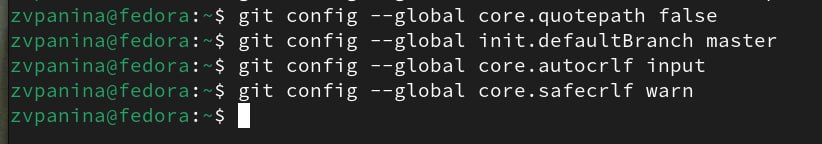

---
## Front matter
title: "Отчёт по лабораторной работе №2"
subtitle: "Дисциплина: Архитектура компьютера"
author: "Панина Жанна Валерьевна"

## Generic otions
lang: ru-RU
toc-title: "Содержание"

## Bibliography
bibliography: bib/cite.bib
csl: pandoc/csl/gost-r-7-0-5-2008-numeric.csl

## Pdf output format
toc: true # Table of contents
toc-depth: 2
lof: true # List of figures
lot: true # List of tables
fontsize: 12pt
linestretch: 1.5
papersize: a4
documentclass: scrreprt
## I18n polyglossia
polyglossia-lang:
  name: russian
  options:
	- spelling=modern
	- babelshorthands=true
polyglossia-otherlangs:
  name: english
## I18n babel
babel-lang: russian
babel-otherlangs: english
## Fonts
mainfont: IBM Plex Serif
romanfont: IBM Plex Serif
sansfont: IBM Plex Sans
monofont: IBM Plex Mono
mathfont: STIX Two Math
mainfontoptions: Ligatures=Common,Ligatures=TeX,Scale=0.94
romanfontoptions: Ligatures=Common,Ligatures=TeX,Scale=0.94
sansfontoptions: Ligatures=Common,Ligatures=TeX,Scale=MatchLowercase,Scale=0.94
monofontoptions: Scale=MatchLowercase,Scale=0.94,FakeStretch=0.9
mathfontoptions:
## Biblatex
biblatex: true
biblio-style: "gost-numeric"
biblatexoptions:
  - parentracker=true
  - backend=biber
  - hyperref=auto
  - language=auto
  - autolang=other*
  - citestyle=gost-numeric
## Pandoc-crossref LaTeX customization
figureTitle: "Рис."
tableTitle: "Таблица"
listingTitle: "Листинг"
lofTitle: "Список иллюстраций"
lotTitle: "Список таблиц"
lolTitle: "Листинги"
## Misc options
indent: true
header-includes:
  - \usepackage{indentfirst}
  - \usepackage{float} # keep figures where there are in the text
  - \floatplacement{figure}{H} # keep figures where there are in the text
---

# Цель работы

Целью данной работы является изучить идеологию и применение средств
контроля версий, а также приобрести практические навыки по работе с системой git.

# Задание

1. Настройка GitHub.
2. Базовая настройка Git.
3. Создание SSH-ключа.
4. Создание рабочего пространства и репозитория курса на основе шаблона.
5. Создание репозитория курса на основе шаблона.
6. Настройка каталога курса.
7. Выполнение заданий для самостоятельной работы.

# Теоретическое введение

3.1. Системы контроля версий. Общие понятия Системы контроля версий (Version Control System, VCS) применяются при работе нескольких человек над одним проектом. Обычно основное дерево проекта хранится в локальном или удалённом репозитории, к которому настроен доступ для участников про екта. При внесении изменений в содержание проекта система контроля версий позволяет их фиксировать, совмещать изменения, произведённые разными участниками проекта, производить откат к любой более ранней версии проекта, если это требуется. 
В классических системах контроля версий используется централизованная модель, предполагающая наличие единого репозитория для хранения файлов. Выполнение большинства функций по управлению версиями осуществляется специальным сервером. Участник проекта (пользователь) перед началом работы посредством определённых команд получает нужную ему версию файлов. После внесения изменений, пользователь размещает новую версию в хранилище. При этом предыдущие версии не удаляются из центрального хранилища и к ним можно вернуться в любой момент. Сервер может сохранять не полную версию изменённых файлов, а производить так называемую дельта-компрессию — сохранять только изменения между последовательными версиями, что позволяет уменьшить объём хранимых данных. 
Системы контроля версий поддерживают возможность отслеживания и разрешения конфликтов, которые могут возникнуть при работе нескольких человек над одним файлом. Можно объединить (слить) изменения, сделанные разными участниками (автоматически или вручную), вручную выбрать нужную версию, отменить изменения вовсе или заблокировать файлы для изменения. В зависимости от настроек блокировка не позволяет другим пользователям получить рабочую копию или препятствует изменению рабочей копии файла средствами файловой системы ОС, обеспечивая таким образом, привилегированный доступ только одному пользователю, работающему с файлом. 
Системы контроля версий также могут обеспечивать дополнительные, более гибкие функциональные возможности. Например, они могут поддерживать работу с несколькими версиями одного файла, сохраняя общую историю изменений до точки ветвления версий и собственные истории изменений каждой ветви. Кроме того, обычно доступна информация о том, кто из участников, когда и какие изменения вносил. Обычно такого рода информация хранится в журнале изменений, доступ к которому можно ограничить. 
В отличие от классических, в распределённых системах контроля версий центральный репозиторий не является обязательным. 
Среди классических VCS наиболее известны CVS, Subversion, а среди распределённых — Git, Bazaar, Mercurial. Принципы их работы схожи, отличаются они в основном синтаксисом используемых в работе команд. 
3.2. Система контроля версий Git
 Система контроля версий Git представляет собой набор программ командной строки. Доступ к ним можно получить из терминала посредством ввода команды git с различными опциями. 
Благодаря тому, что Git является распределённой системой контроля версий, резервную копию локального хранилища можно сделать простым копированием или архивацией. 
3.3. Основные команды git
Наиболее часто используемые команды git представлены в таблице 2.1. Таблица 2.1. Основные команды git 
Команда	Описание
git init	создание основного дерева репозитория
git pull	получение обновлений (изменений) текущего дерева из центрального репозитория
git push	отправка всех произведённых изменений локального дерева в центральный репозиторий
git status	просмотр списка изменённых файлов в текущей директории
git diff	просмотр текущих изменений
git add .	добавить все изменённые и/или созданные файлы и/или каталоги
git add имена_файлов	добавить конкретные изменённые и/или созданные файлы и/или каталоги
git rm имена_файлов	удалить файл и/или каталог из индекса репозитория (при этом файл и/или каталог остаётся в локальной директории)
git commit -am 'Описание коммита'	сохранить все добавленные изменения и все изменённые файлы
git checkout -b имя_ветки	создание новой ветки, базирующейся на текущей
git checkout имя_ветки	переключение на некоторую ветку (при переключении на ветку, которой ещё нет в локальном репозитории, она будет создана и связана с удалённой)
git push origin имя_ветки	отправка изменений конкретной ветки в центральный репозиторий
git merge --no-ff имя_ветки	слияние ветки с текущим деревом
git branch -d имя_ветки	удаление локальной уже слитой с основным деревом ветки
git branch -D имя_ветки	принудительное удаление локальной ветки
git push origin :имя_ветки	удаление ветки с центрального репозитория

3.4. Стандартные процедуры работы при наличии центрального репозитория
Работа пользователя со своей веткой начинается с проверки и получения изменений из центрального репозитория (при этом в локальное дерево до начала этой процедуры не должно было вноситься изменений): 
git checkout master 
git pull 
git checkout -b имя_ветки 
Затем можно вносить изменения в локальном дереве и/или ветке. После завершения внесения какого-то изменения в файлы и/или каталоги проекта необходимо разместить их в центральном репозитории. Для этого необходимо проверить, какие файлы изменились к текущему моменту: 
git status 
и при необходимости удаляем лишние файлы, которые не хотим отправлять в центральный репозиторий. 
Затем полезно просмотреть текст изменений на предмет соответствия правилам ведения чистых коммитов: 
git diff 
Если какие-либо файлы не должны попасть в коммит, то помечаем только те файлы, изменения которых нужно сохранить. Для этого используем команды добавления и/или удаления с нужными опциями: 
git add имена_файлов 
git rm имена_файлов 
Если нужно сохранить все изменения в текущем каталоге, то используем: 
git add . 
Затем сохраняем изменения, поясняя, что было сделано: 
git commit -am "Some commit message" 
и отправляем в центральный репозиторий: 
git push origin имя_ветки или git push
 

# Выполнение лабораторной работы

## Настройка github 

Я создала учётную запись на сайте https://github.com/ и заполнила основные данные. (рис. [-@fig:001])
 
{#fig:001 width=70%}

## Базовая настройка git 

Сначала сделаем предварительную конфигурацию git. Открываю терминал и ввожу следующие команды, указав своё имя и email (рис. [-@fig:002])
 
{#fig:002 width=70%}

Настроим utf-8 в выводе сообщений git, зададим имя начальной ветки (будем называть её master); параметр autocrlf; параметр safecrlf (рис. [-@fig:003])
  
{#fig:003 width=70%}

## Создание SSH ключа

Для последующей идентификации пользователя на сервере репозиториев генерирую пару ключей (приватный и открытый)(рис. [-@fig:004])
 
{#fig:004 width=70%}

 Далее мне необходимо загрузить сгенерированный открытый ключ. Для этого захожу на сайт http://github.org/ под своей учётной записью и перехожу в меню Settings . После этого выбираю в боковом меню SSH and GPG keys и нажимаю кнопку New SSH key (рис. [-@fig:005]) 
 
{#fig:005 width=70%}

Скопировав из локальной консоли ключ в буфер обмена cat ~/.ssh/id_rsa.pub | xclip -sel clip нужно вставить ключ в появившееся на сайте поле и указать для ключа имя (Title) (рис. [-@fig:006])

{#fig:006 width=70%}

Как я поняла, введя эту команду, мне сначала нужно установить утилиту xclip.  (рис. [-@fig:007])
 
{#fig:007 width=70%}

Ввожу команду повторно и вижу, что нужная мне папка не находится, значит, она скрыта, как видно через команду ls –la, т.е. мне нужно использовать права админа (команда sudo)  (рис. [-@fig:008])
 
{#fig:008 width=70%}

Далее вставляю ключ в появившееся на сайте поле и указываю для ключа имя (Title) (рис. [-@fig:009])
 
{#fig:009 width=70%}

## Сознание рабочего пространства и репозитория курса на основе шаблона

Открываю терминал и создаю каталог для предмета «Архитектура компьютера» (рис. [-@fig:010])
 
{#fig:010 width=70%}

## Сознание репозитория курса на основе шаблона
Репозиторий на основе шаблона можно создать через web-интерфейс github. Перехожу на страницу репозитория с шаблоном курса https://github.com/yamadharma/course-directory-student-template. Далее выбираю Use this template.(рис. [-@fig:011])
  
{#fig:011 width=70%}

В открывшемся окне задаю имя репозитория (Repository name) study_2023–2024_arh-pc и создаю репозиторий (рис. [-@fig:012])
  
{#fig:012 width=70%}

Открываю терминал и перехожу в каталог курса.
cd ~/work/study/2023–2024/"Архитектура компьютера" Клонирую созданный репозиторий (рис. [-@fig:013])
 
{#fig:013 width=70%}

## Настройка каталога курса
Перехожу в каталог курса и удаляю лишние файлы (рис. [-@fig:014])
 
{#fig:014 width=70%}

Создаю необходимые каталоги (рис. [-@fig:015])
 
{#fig:015 width=70%}

Отправляю файлы на сервер (рис. [-@fig:016])

{#fig:016 width=70%}

(рис. [-@fig:017])

{#fig:017 width=70%}

Проверяю правильность создания иерархии рабочего пространства в локальном репозитории и на странице github (рис. [-@fig:018])
   
{#fig:018 width=70%}
 
## Выполнение заданий для самостоятельной работы

1. Создаю отчет по выполнению лабораторной работы в соответствующем каталоге рабочего пространства (labs>lab02>report). (рис. [-@fig:019])
 
{#fig:019 width=70%}

2. Копирую отчеты по выполнению предыдущих лабораторных работ в соответствующие каталоги созданного рабочего пространства.

3. Загружаю файлы на github.

# Выводы

В ходе выполнения работы я изучила идеологию и применение средств
контроля версий, а также приобрела практические навыки по работе с системой git.

# Список литературы{.unnumbered}

[Архитектура ЭВМ](https://esystem.rudn.ru/pluginfile.php/2089082/mod_resource/content/0/%D0%9B%D0%B0%D0%B1%D0%BE%D1%80%D0%B0%D1%82%D0%BE%D1%80%D0%BD%D0%B0%D1%8F%20%D1%80%D0%B0%D0%B1%D0%BE%D1%82%D0%B0%20%E2%84%962.%20%D0%A1%D0%B8%D1%81%D1%82%D0%B5%D0%BC%D0%B0%20%D0%BA%D0%BE%D0%BD%D1%82%D1%80%D0%BE%D0%BB%D1%8F%20%D0%B2%D0%B5%D1%80%D1%81%D0%B8%D0%B9%20Git.pdf)
