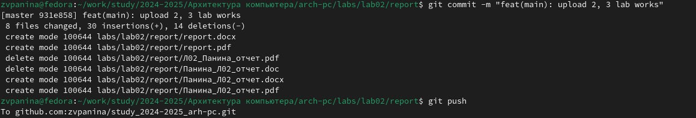

---
## Front matter
title: "Отчёт по лабораторной работе"
subtitle: "Дисциплина: Архитектура компьютера"
author: "Панина Жанна Валерьевна, НКАбд-04-24"

## Generic otions
lang: ru-RU
toc-title: "Содержание"

## Bibliography
bibliography: bib/cite.bib
csl: pandoc/csl/gost-r-7-0-5-2008-numeric.csl

## Pdf output format
toc: true # Table of contents
toc-depth: 2
lof: true # List of figures
lot: true # List of tables
fontsize: 12pt
linestretch: 1.5
papersize: a4
documentclass: scrreprt
## I18n polyglossia
polyglossia-lang:
  name: russian
  options:
	- spelling=modern
	- babelshorthands=true
polyglossia-otherlangs:
  name: english
## I18n babel
babel-lang: russian
babel-otherlangs: english
## Fonts
mainfont: IBM Plex Serif
romanfont: IBM Plex Serif
sansfont: IBM Plex Sans
monofont: IBM Plex Mono
mathfont: STIX Two Math
mainfontoptions: Ligatures=Common,Ligatures=TeX,Scale=0.94
romanfontoptions: Ligatures=Common,Ligatures=TeX,Scale=0.94
sansfontoptions: Ligatures=Common,Ligatures=TeX,Scale=MatchLowercase,Scale=0.94
monofontoptions: Scale=MatchLowercase,Scale=0.94,FakeStretch=0.9
mathfontoptions:
## Biblatex
biblatex: true
biblio-style: "gost-numeric"
biblatexoptions:
  - parentracker=true
  - backend=biber
  - hyperref=auto
  - language=auto
  - autolang=other*
  - citestyle=gost-numeric
## Pandoc-crossref LaTeX customization
figureTitle: "Рис."
tableTitle: "Таблица"
listingTitle: "Листинг"
lofTitle: "Список иллюстраций"
lotTitle: "Список таблиц"
lolTitle: "Листинги"
## Misc options
indent: true
header-includes:
  - \usepackage{indentfirst}
  - \usepackage{float} # keep figures where there are in the text
  - \floatplacement{figure}{H} # keep figures where there are in the text
---

# Цель работы

Целью работы является освоение процедуры оформления отчетов с помощью легковесного
языка разметки Markdown.

# Задание

1. Установка необходимого ПО
2. Заполнение отчета по выполнению лабораторной работы №4 с помощью языка разметки Markdown
3. Задание для самостоятельной работы

Перед началом выполнения работы я установила LaTex, pandoc и pandoc-crossref соответствующей версии pandoc, руководствуясь рекомендациями по установке ПО в ТУИС.

# Выполнение лабораторной работы

1. Открываю терминал
2. Перехожу в каталог курса, сформированный при выполнении лабораторной работы №2.
Обновляю локальный репозиторий, скачав изменения из удаленного репозитория с помощью команды git pull
3. Перехожу в каталог с шаблоном отчета по лабораторной работе № 3
4. Провожу компиляцию шаблона с использованием Makefile. Для этого ввожу команду make (рис. [-@fig:001]).

{#fig:001 width=70%}

При успешной компиляции должны сгенерироваться файлы report.pdf и report.docx.
Открываю и проверяю корректность полученных файлов(рис. [-@fig:002]).

{#fig:002 width=70%}

5. Удаляю полученные файлы с использованием Makefile. Для этого ввожу команду make clean. Проверяю, что после этой команды файлы report.pdf и report.docx были удалены (рис. [-@fig:003]).

{#fig:003 width=70%}

6. Открываю файл report.md c помощью екстового редактора gedit, установив его (рис. [-@fig:004]).

{#fig:004 width=70%}

Внимательно изучаю структуру этого файла (рис. [-@fig:005]).

{#fig:005 width=70%}

7. Заполняю отчет и компилирую отчет с использованием Makefile (рис. [-@fig:006]).

{#fig:006 width=70%}

Проверяю корректность полученных файлов. (Для корректного отображения скриншотов предварительно размещаю их в каталоге image)

8. Загружаю файлы на Github (рис. [-@fig:007]).

{#fig:007 width=70%}

# Задания для самостоятельной работы

1. В соответствующем каталоге делаю отчёт по лабораторной работе № 2 в формате Markdown 
2. Загружаю файлы на github (рис. [-@fig:008]).

{#fig:008 width=70%}

# Выводы

В ходе выполнения работы я освоила процедуру оформления отчетов с помощью легковесного
языка разметки Markdown.

# Список литературы{.unnumbered}
[Архитектура ЭВМ](https://esystem.rudn.ru/pluginfile.php/2089083/mod_resource/content/0/%D0%9B%D0%B0%D0%B1%D0%BE%D1%80%D0%B0%D1%82%D0%BE%D1%80%D0%BD%D0%B0%D1%8F%20%D1%80%D0%B0%D0%B1%D0%BE%D1%82%D0%B0%20%E2%84%963.%20%D0%AF%D0%B7%D1%8B%D0%BA%20%D1%80%D0%B0%D0%B7%D0%BC%D0%B5%D1%82%D0%BA%D0%B8%20.pdf)
[Рекомендации по установке необходимого ПО](https://esystem.rudn.ru/mod/assign/view.php?id=1030646)
::: {#refs}
:::
