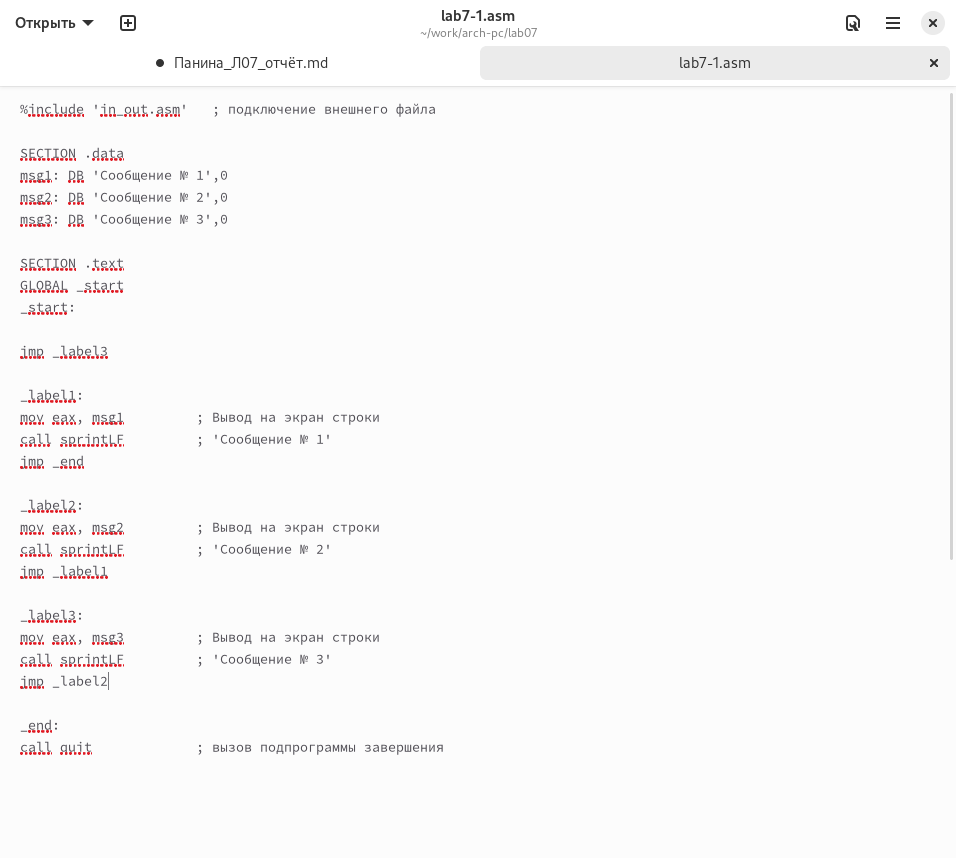

---
## Front matter
title: "Отчет по лабораторной работе №7"
subtitle: "Дисциплина: архитектура компьютера"
author: "Панина Жанна Валерьевна"

## Generic otions
lang: ru-RU
toc-title: "Содержание"

## Bibliography
bibliography: bib/cite.bib
csl: pandoc/csl/gost-r-7-0-5-2008-numeric.csl

## Pdf output format
toc: true # Table of contents
toc-depth: 2
lof: true # List of figures
lot: true # List of tables
fontsize: 12pt
linestretch: 1.5
papersize: a4
documentclass: scrreprt
## I18n polyglossia
polyglossia-lang:
  name: russian
  options:
	- spelling=modern
	- babelshorthands=true
polyglossia-otherlangs:
  name: english
## I18n babel
babel-lang: russian
babel-otherlangs: english
## Fonts
mainfont: IBM Plex Serif
romanfont: IBM Plex Serif
sansfont: IBM Plex Sans
monofont: IBM Plex Mono
mathfont: STIX Two Math
mainfontoptions: Ligatures=Common,Ligatures=TeX,Scale=0.94
romanfontoptions: Ligatures=Common,Ligatures=TeX,Scale=0.94
sansfontoptions: Ligatures=Common,Ligatures=TeX,Scale=MatchLowercase,Scale=0.94
monofontoptions: Scale=MatchLowercase,Scale=0.94,FakeStretch=0.9
mathfontoptions:
## Biblatex
biblatex: true
biblio-style: "gost-numeric"
biblatexoptions:
  - parentracker=true
  - backend=biber
  - hyperref=auto
  - language=auto
  - autolang=other*
  - citestyle=gost-numeric
## Pandoc-crossref LaTeX customization
figureTitle: "Рис."
tableTitle: "Таблица"
listingTitle: "Листинг"
lofTitle: "Список иллюстраций"
lotTitle: "Список таблиц"
lolTitle: "Листинги"
## Misc options
indent: true
header-includes:
  - \usepackage{indentfirst}
  - \usepackage{float} # keep figures where there are in the text
  - \floatplacement{figure}{H} # keep figures where there are in the text
---

# Цель работы

Изучение команд условного и безусловного переходов. Приобретение навыков написания
программ с использованием переходов. Знакомство с назначением и структурой файла
листинга.

# Задание

1. Реализация переходов в NASM
2. Изучение структуры файлов листинга
3. Самостоятельное написание программ по материалам лабораторной работы

# Теоретическое введение

Для реализации ветвлений в ассемблере используются так называемые команды передачи
управления или команды перехода. Можно выделить 2 типа переходов:
• условный переход – выполнение или не выполнение перехода в определенную точку
программы в зависимости от проверки условия.
• безусловный переход – выполнение передачи управления в определенную точку про-
граммы без каких-либо условий.

# Выполнение лабораторной работы

## Реализация переходов в NASM

Создаю каталог для программ лабораторной работы №7, перехожу в него и создаю файл lab7-1.asm (рис. -@fig:001).

{#fig:001 width=70%}

Копирую код из листинга в файл будущей программы. (рис. -@fig:002).

{#fig:002 width=70%}

Создаю исполняемый файл и запускаю его. Вижу, что использование инструкции jmp _label2 меняет порядок исполнения инструкций и позволяет выполнить инструкции начиная с метки _label2,пропустив вывод первого сообщения (рис. -@fig:003).

{#fig:003 width=70%}

Изменяю программу таким образом, чтобы поменялся порядок выполнения функций (рис. -@fig:004).

{#fig:004 width=70%}

Запускаю программу и проверяю, что примененные изменения верны (рис. -@fig:005).

{#fig:005 width=70%}

Теперь изменяю текст программы так, чтобы все три сообщения вывелись в обратном порядке (рис. -@fig:006).

{#fig:006 width=70%}

Работа выполнена корректно, программа в нужном мне порядке выводит сообщения (рис. -@fig:007).

{#fig:007 width=70%}

Создаю файл lab7-2.asm и вставляю в него код из листинга 7.3 (рис. -@fig:008).

{#fig:008 width=70%}

Программа выводит значение переменной с наибольшим значением, проверяю работу программы с разными входными данными (рис. -@fig:009).

{#fig:009 width=70%}

## Изучение структуры файла листинга

Создаю файл листинга с помощью флага -l команды nasm и открываю его с помощью текстового редактора mousepad (рис. -@fig:010).

{#fig:010 width=70%}

Первое значение в файле листинга - номер строки, и он может вовсе не совпадать с номером строки изначального файла. Второе вхождение - адрес, смещение машинного кода относительно начала текущего сегмента, затем непосредственно идет сам машинный код, а заключает строку исходный текст прогарммы с комментариями.

Удаляю один операнд из случайной инструкции, чтобы проверить поведение файла листинга в дальнейшем (рис. -@fig:011).

{#fig:011 width=70%}

Выполняю трансляцию с получением файла листинга. В новом файле листинга показывает ошибку, которая возникла при попытке трансляции файла. Никакие выходные файлы при этом помимо файла листинга не создаются. (рис. -@fig:012).

{#fig:012 width=70%}

## Задания для самостоятельной работы

1. Буду использовать значения переменных из варианта 11, который выпал мне при выполнении прошлой лабораторной работы. Возвращаю операнд к функции в программе и изменяю ее так, чтобы она выводила переменную с наименьшим значением (рис. -@fig:013).

{#fig:013 width=70%}

Код первой программы: 

```NASM
%include 'in_out.asm'

SECTION .data
msg1 db 'Введите В: ', 0h
msg2 db 'Наименьшее число: ', 0h
A dd '21'
C dd '34'

SECTION .bss
min resb 10
B resb 10

SECTION .text
GLOBAL _start
_start:
;--------------  Вывод сообщения 'Введите B: '
mov eax, msg1
call sprint
;--------------  Ввод 'B'
mov ecx, B
mov edx, 10
call sread
;--------------  Преобразование 'B' из символа в число
mov eax, B
call atoi        ; Вызов подпрограммы перевода символа в число
mov [B], eax     ; запись преобразованного числа в 'B'
;-----------  Записываем 'A' в переменную 'min'
mov ecx, [A]     ; 'ecx = A'
mov [min], ecx   ; 'min = A'
;-----------  Сравниваем 'A' и 'C' (как символы)
cmp ecx, [C]     ; Сравниваем 'A' и 'C'
jl check_B       ; если 'A<C', то переход на метку 'check_B'
mov ecx, [C]     ; иначе 'ecx = C'
mov [min], ecx   ; 'min = C'
;-----------  Преобразование 'min(A, C)' из символа в число
check_B:
mov eax, min
call atoi       ; Вызов подпрограммы перевода символа в число 
mov [min], eax  ; запись преобразованного числа в 'min'
;-----------  Сравниваем 'min(A,C)' и 'B' (как числа)
mov ecx, [min]
cmp ecx, [B]    ; Сравниваем 'min(A,C)' и 'B'
jl fin          ; Если 'min(A,C)>B', то переход на 'fin',
mov ecx, [B]    ; иначе 'ecx = B'
mov [min], ecx
;---------- Вывод результата
fin:
mov eax, msg2
call sprint    ; Вывод сообщения 'Наибольшее число: '
mov eax, [min]
call iprintLF  ; Вывод 'max(A,B,C)'
call quit      ; Выход
```

Проверяю корректность написания первой программы (рис. -@fig:014).

{#fig:014 width=70%}

Пишу программу, которая будет вычислять значение заданной функции согласно моему варианту для введенных с клавиатуры переменных a и x (рис. -@fig:015).

{#fig:015 width=70%}

Код второй программы: 

```NASM
%include 'in_out.asm'
SECTION .data
msg1: DB 'Введите значение переменной x: ', 0
msg2: DB 'Введите значение переменной a: ', 0
msg3: DB 'Результат: ', 0

SECTION .bss
x: RESB 80
a: RESB 80

SECTION .text
GLOBAL _start
_start:

mov eax, msg1
call sprint
mov ecx, x
mov edx, 80
call sread
mov eax, x
call atoi
mov edi, eax

mov eax, msg2
call sprint
mov ecx, a
mov edx, 80
call sread
mov eax, a
call atoi
mov esi, eax

cmp esi, 0
jne add_values
mov eax, esi
mov ebx, 4
mul ebx
jmp print_result

add_values:
mov eax, esi
mov ebx, 4
mul ebx
add eax, edi

print_result:
mov edi, eax
mov eax, msg3
call sprint
mov eax, edi
call iprintLF
call quit
```

Транслирую и компоную файл, запускаю и проверяю работу программы для различных значений a и x (рис. -@fig:016).

{#fig:016 width=70%}

# Выводы

При выполнении лабораторной работы я изучила команды условных и безусловных переходов, а также приобрела навыки написания программ с использованием переходов, познакомилась
с назначением и структурой файлов листинга.

# Список литературы{.unnumbered}

1. [Курс на ТУИС](https://esystem.rudn.ru/course/view.php?id=112)
2. [Лабораторная работа №7](https://esystem.rudn.ru/pluginfile.php/2089087/mod_resource/content/0/%D0%9B%D0%B0%D0%B1%D0%BE%D1%80%D0%B0%D1%82%D0%BE%D1%80%D0%BD%D0%B0%D1%8F%20%D1%80%D0%B0%D0%B1%D0%BE%D1%82%D0%B0%20%E2%84%967.%20%D0%9A%D0%BE%D0%BC%D0%B0%D0%BD%D0%B4%D1%8B%20%D0%B1%D0%B5%D0%B7%D1%83%D1%81%D0%BB%D0%BE%D0%B2%D0%BD%D0%BE%D0%B3%D0%BE%20%D0%B8%20%D1%83%D1%81%D0%BB%D0%BE%D0%B2%D0%BD%D0%BE%D0%B3%D0%BE%20%D0%BF%D0%B5%D1%80%D0%B5%D1%85%D0%BE%D0%B4%D0%BE%D0%B2%20%D0%B2%20Nasm.%20%D0%9F%D1%80%D0%BE%D0%B3%D1%80%D0%B0%D0%BC%D0%BC%D0%B8%D1%80%D0%BE%D0%B2%D0%B0%D0%BD%D0%B8%D0%B5%20%D0%B2%D0%B5%D1%82%D0%B2%D0%BB%D0%B5%D0%BD%D0%B8%D0%B9.pdf)
3. [Программирование на языке ассемблера NASM Столяров А. В.](https://esystem.rudn.ru/pluginfile.php/2088953/mod_resource/content/2/%D0%A1%D1%82%D0%BE%D0%BB%D1%8F%D1%80%D0%BE%D0%B2%20%D0%90.%20%D0%92.%20-%20%D0%9F%D1%80%D0%BE%D0%B3%D1%80%D0%B0%D0%BC%D0%BC%D0%B8%D1%80%D0%BE%D0%B2%D0%B0%D0%BD%D0%B8%D0%B5%20%D0%BD%D0%B0%20%D1%8F%D0%B7%D1%8B%D0%BA%D0%B5%20%D0%B0%D1%81%D1%81%D0%B5%D0%BC%D0%B1%D0%BB%D0%B5%D1%80%D0%B0%20NASM%20%D0%B4%D0%BB%D1%8F%20%D0%9E%D0%A1%20Unix.pdf)
